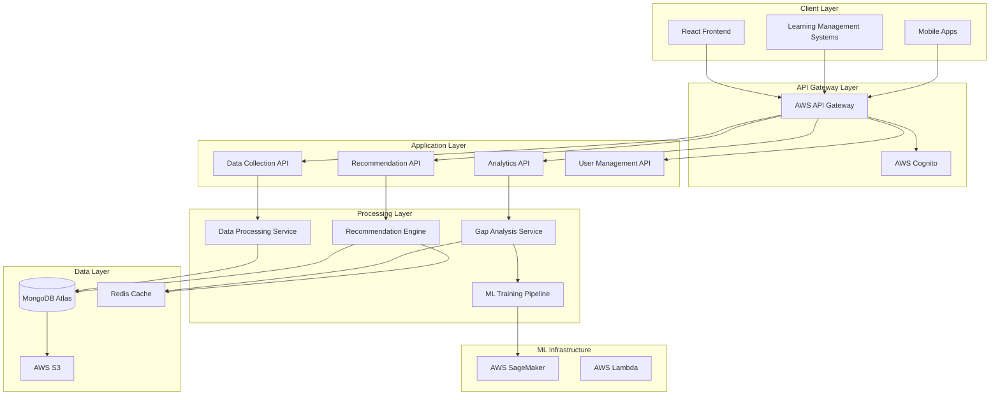

# Design Document: Learning Analytics Platform Backend

## Overview

The Learning Analytics Platform backend is a cloud-native, AI-driven system built on AWS that processes student performance data to identify learning gaps and generate personalized recommendations. The architecture follows microservices principles with separate services for data collection, AI analysis, and recommendation generation, all orchestrated through a central API gateway.

## Architecture

### High-Level Architecture



### Technology Stack

- **Runtime**: Python 3.11 with FastAPI framework
- **Database**: MongoDB Atlas for document storage
- **Cache**: Redis for session and computation caching
- **ML Platform**: AWS SageMaker for model training and inference
- **Storage**: AWS S3 for file storage and data lakes
- **Authentication**: AWS Cognito for user management
- **API Gateway**: AWS API Gateway for request routing
- **Containerization**: Docker with AWS ECS for deployment
- **Monitoring**: AWS CloudWatch and X-Ray for observability

## Components and Interfaces

### 1. Data Collection API Service

**Purpose**: Handles ingestion of student performance data from various sources

**Key Components**:

- `QuizDataCollector`: Processes quiz submissions and scores
- `CodeSubmissionProcessor`: Analyzes coding assignments
- `DataValidator`: Ensures data integrity and format compliance
- `PerformanceDataStore`: Manages storage of raw performance data

**API Endpoints**:

```python
POST /api/v1/data/quiz-submission
POST /api/v1/data/code-submission
GET /api/v1/data/student/{student_id}/performance
PUT /api/v1/data/performance/{submission_id}
```

**Data Flow**:

1. Receive performance data via REST API
2. Validate data format and integrity
3. Enrich data with metadata (timestamps, student context)
4. Store in MongoDB with appropriate indexing
5. Trigger async processing for gap analysis

### 2. Gap Analysis Service

**Purpose**: AI-powered service that identifies learning gaps from performance data

**Key Components**:

- `ConceptMapper`: Maps questions/problems to learning concepts
- `GapDetectionModel`: ML model for identifying knowledge gaps
- `PerformanceAnalyzer`: Statistical analysis of student performance
- `GapRanker`: Prioritizes gaps by severity and impact

**ML Models**:

- **Concept Classification Model**: Maps quiz questions to knowledge concepts
- **Gap Detection Model**: Identifies patterns indicating learning gaps
- **Difficulty Assessment Model**: Evaluates concept difficulty for students

**Processing Pipeline**:

1. Retrieve student performance data from MongoDB
2. Apply concept mapping to identify relevant knowledge areas
3. Run gap detection algorithms using trained ML models
4. Rank gaps by severity and learning impact
5. Store gap analysis results with confidence scores

### 3. Recommendation Engine Service

**Purpose**: Generates personalized learning recommendations based on identified gaps

**Key Components**:

- `ResourceMatcher`: Matches learning resources to specific gaps
- `PathGenerator`: Creates sequential learning paths
- `PersonalizationEngine`: Adapts recommendations to learning styles
- `ProgressTracker`: Monitors recommendation effectiveness

**Recommendation Algorithms**:

- **Collaborative Filtering**: Recommends resources based on similar students
- **Content-Based Filtering**: Matches resources to specific learning gaps
- **Knowledge Graph Traversal**: Ensures prerequisite concepts are covered
- **Adaptive Sequencing**: Adjusts path based on student progress

### 4. User Management API Service

**Purpose**: Handles user authentication, authorization, profile management, and complete user onboarding

**Key Components**:

- `AuthenticationHandler`: Integrates with AWS Cognito for secure login/signup
- `OnboardingService`: Manages new user registration and initial platform setup
- `ProfileManager`: Manages student and instructor profiles with learning preferences
- `PermissionController`: Enforces role-based access control
- `DataPrivacyManager`: Handles FERPA compliance and data requests
- `CredentialManager`: Securely stores and validates user credentials
- `PreferenceEngine`: Manages user learning preferences and goals

**Complete User Onboarding Flow**:

1. **Account Creation**: Users register with email/password, receive verification email
2. **Email Verification**: Users verify email address to activate account
3. **Profile Setup**: Users provide basic information (name, role, institution)
4. **Learning Preferences**: Students set learning style preferences, study time availability
5. **Initial Assessment**: Optional diagnostic quiz to establish baseline knowledge
6. **Course Enrollment**: Users join courses or create instructor accounts
7. **Dashboard Personalization**: System configures personalized dashboard based on role and preferences

**Optimized Existing User Login Flow**:

```python
# Backend Login Flow (Performance Optimized)
1. Frontend sends JWT token -> AWS Cognito validates authentication
2. Backend validates JWT token for security
3. Single optimized database query fetches:
   - User profile (preferences, academic info)
   - Latest concept mastery scores (current learning state)
   - Active recommendations (pre-computed, not generated on-demand)
4. Return aggregated dashboard payload in single response
5. No heavy ML computation during login (all analytics pre-computed)
```

**Key Performance Optimizations**:

- **Pre-computed Analytics**: Learning gaps and recommendations calculated asynchronously in background
- **Aggregated Queries**: Single database call fetches all dashboard data
- **Redis Caching**: Recent analysis results cached for instant retrieval
- **Lightweight Payload**: Dashboard contains only essential data for immediate display
- **Background Processing**: Heavy ML computations happen after login, not during

**API Endpoints**:

```python
# Authentication
POST /api/v1/auth/register
POST /api/v1/auth/login
POST /api/v1/auth/logout
POST /api/v1/auth/verify-email
POST /api/v1/auth/reset-password
POST /api/v1/auth/refresh-token

# User Profile Management
GET /api/v1/users/profile
PUT /api/v1/users/profile
DELETE /api/v1/users/profile

# Onboarding
POST /api/v1/users/onboarding/start
PUT /api/v1/users/onboarding/preferences
POST /api/v1/users/onboarding/assessment
POST /api/v1/users/onboarding/complete

# User Preferences
GET /api/v1/users/preferences
PUT /api/v1/users/preferences
GET /api/v1/users/learning-style
PUT /api/v1/users/learning-style
```

## Data Models

### User Profile Schema

```python
{
  "_id": ObjectId,
  "user_id": str,  # AWS Cognito user ID
  "email": str,
  "username": str,
  "first_name": str,
  "last_name": str,
  "role": str,  # "student" | "instructor" | "admin"
  "institution": str,
  "created_at": datetime,
  "last_login": datetime,
  "email_verified": bool,
  "profile_completed": bool,
  "onboarding_completed": bool,
  "learning_preferences": {
    "learning_style": str,  # "visual" | "auditory" | "kinesthetic" | "mixed"
    "study_time_preference": str,  # "morning" | "afternoon" | "evening" | "flexible"
    "difficulty_preference": str,  # "gradual" | "challenging" | "adaptive"
    "resource_preferences": [str],  # ["video", "text", "interactive", "practice"]
    "notification_preferences": {
      "email_notifications": bool,
      "push_notifications": bool,
      "achievement_alerts": bool,
      "reminder_frequency": str  # "daily" | "weekly" | "never"
    }
  },
  "academic_info": {
    "major": str,
    "year": str,  # "freshman" | "sophomore" | "junior" | "senior" | "graduate"
    "gpa": float,
    "enrolled_courses": [str]
  }
}
```

### Student Performance Schema

```python
{
  "_id": ObjectId,
  "student_id": str,
  "submission_type": str,  # "quiz" | "code"
  "course_id": str,
  "assignment_id": str,
  "timestamp": datetime,
  "score": float,
  "max_score": float,
  "question_responses": [
    {
      "question_id": str,
      "response": str,
      "correct": bool,
      "concept_tags": [str]
    }
  ],
  "code_metrics": {
    "complexity": int,
    "test_coverage": float,
    "execution_time": float,
    "memory_usage": int
  }
}
```

### Learning Gap Schema

```python
{
  "_id": ObjectId,
  "student_id": str,
  "concept_id": str,
  "gap_severity": float,  # 0.0 to 1.0
  "confidence_score": float,
  "identified_at": datetime,
  "last_updated": datetime,
  "supporting_evidence": [
    {
      "submission_id": ObjectId,
      "evidence_type": str,
      "weight": float
    }
  ],
  "improvement_trend": float
}
```

### Recommendation Schema

```python
{
  "_id": ObjectId,
  "student_id": str,
  "gap_id": ObjectId,
  "resource_type": str,  # "video" | "article" | "exercise" | "practice"
  "resource_url": str,
  "title": str,
  "description": str,
  "estimated_time": int,  # minutes
  "difficulty_level": str,
  "priority_score": float,
  "generated_at": datetime,
  "completed": bool,
  "effectiveness_rating": float
}
```

## Correctness Properties

_A property is a characteristic or behavior that should hold true across all valid executions of a system—essentially, a formal statement about what the system should do. Properties serve as the bridge between human-readable specifications and machine-verifiable correctness guarantees._

### Data Collection Properties

**Property 1: Complete quiz data capture**
_For any_ quiz submission, all question-level accuracy data should be captured and stored with the submission
**Validates: Requirements 1.1**

**Property 2: Code analysis completeness**
_For any_ code submission, the analysis should produce correctness, efficiency, and concept understanding metrics
**Validates: Requirements 1.2**

**Property 3: Data integrity preservation**
_For any_ performance data submission, the stored data should have valid timestamps and correct student associations
**Validates: Requirements 1.3**

**Property 4: Graceful error handling**
_For any_ invalid or corrupted submission data, the system should handle it gracefully without data loss or system failure
**Validates: Requirements 1.4**

### Gap Analysis Properties

**Property 5: Gap detection consistency**
_For any_ student performance data with known learning gaps, the Gap_Analyzer should identify those gaps with appropriate confidence scores
**Validates: Requirements 2.1**

**Property 6: Concept mapping accuracy**
_For any_ quiz result with incorrect answers, each incorrect answer should be mapped to the correct learning concepts
**Validates: Requirements 2.2**

**Property 7: Code concept assessment**
_For any_ coding submission, the assessment should identify programming concepts, algorithms, and best practices demonstrated or missing
**Validates: Requirements 2.3**

**Property 8: Gap ranking consistency**
_For any_ set of identified learning gaps, they should be ranked by severity with higher severity gaps receiving higher priority scores
**Validates: Requirements 2.4**

**Property 9: Real-time gap updates**
_For any_ new performance data, gap analysis should be updated and reflected in the system within the specified time window
**Validates: Requirements 2.5**

**Property 10: Insufficient data handling**
_For any_ student with minimal performance data, the system should either request additional assessments or provide confidence intervals
**Validates: Requirements 2.6**

### Recommendation Engine Properties

**Property 11: Personalized recommendation generation**
_For any_ student with identified learning gaps, the system should generate recommendations tailored to their specific gaps and learning style
**Validates: Requirements 3.1**

**Property 12: Severity-based prioritization**
_For any_ set of recommendations, those addressing higher severity gaps should receive higher priority scores
**Validates: Requirements 3.2**

**Property 13: Prerequisite ordering**
_For any_ learning path, foundational concepts should be sequenced before advanced concepts that depend on them
**Validates: Requirements 3.3**

**Property 14: Adaptive recommendation updates**
_For any_ completed recommended activity, future recommendations should be updated based on the new performance data
**Validates: Requirements 3.4**

**Property 15: Resource type diversity**
_For any_ set of recommendations, multiple resource types (videos, articles, exercises) should be included when available
**Validates: Requirements 3.5**

**Property 16: Constraint-aware recommendations**
_For any_ student with specified time constraints and learning preferences, recommendations should respect these constraints
**Validates: Requirements 3.6**

### User Onboarding and Authentication Properties

**Property 31: Complete user registration**
_For any_ new user registration with valid credentials, the system should create a user profile and send email verification
**Validates: Requirements 4.1, 4.2**

**Property 32: Email verification requirement**
_For any_ unverified user account, access to platform features should be restricted until email verification is completed
**Validates: Requirements 4.2**

**Property 33: Profile completion tracking**
_For any_ user in the onboarding process, the system should track completion status and guide users through remaining steps
**Validates: Requirements 4.3**

**Property 34: Learning preference persistence**
_For any_ user-specified learning preferences, they should be stored and applied consistently across all recommendation generation
**Validates: Requirements 3.1, 3.6**

**Property 35: Role-based feature access**
_For any_ user with a specific role (student/instructor/admin), they should only have access to features appropriate for that role
**Validates: Requirements 4.5**

### Data Privacy and Security Properties

**Property 17: Complete data retrieval**
_For any_ student data access request, the system should return all stored information associated with that student
**Validates: Requirements 4.3**

**Property 18: Data deletion with analytics preservation**
_For any_ student data deletion request, all personal data should be removed while preserving anonymized analytics data
**Validates: Requirements 4.4**

**Property 19: Access control enforcement**
_For any_ data access request, students should only be able to access their own data and not other students' information
**Validates: Requirements 4.5**

**Property 20: Security event logging**
_For any_ unauthorized access attempt, the system should log the security event and trigger appropriate alerts
**Validates: Requirements 4.6**

### Real-time Monitoring Properties

**Property 21: Dashboard data accuracy**
_For any_ student login, the displayed progress and gap improvements should reflect the most current analysis results
**Validates: Requirements 5.1**

**Property 22: Timely dashboard updates**
_For any_ new performance data processing, student dashboards should be updated within the specified time limit
**Validates: Requirements 5.2**

**Property 23: Achievement notifications**
_For any_ significant progress milestone, the system should generate appropriate notifications for the student
**Validates: Requirements 5.3**

**Property 24: Alternative strategy suggestions**
_For any_ persistent learning gaps, the system should suggest alternative learning strategies or additional resources
**Validates: Requirements 5.4**

**Property 25: Progress trend visualization**
_For any_ student with historical performance data, the system should provide accurate visual indicators of improvement trends
**Validates: Requirements 5.5**

### API Integration Properties

**Property 26: LTI protocol compliance**
_For any_ LTI integration request, the system should handle the request according to LTI standard specifications
**Validates: Requirements 7.2**

**Property 27: API authentication enforcement**
_For any_ third-party API request, proper authentication should be required and verified before providing access
**Validates: Requirements 7.3**

**Property 28: Rate limiting functionality**
_For any_ API usage that exceeds defined limits, the system should implement rate limiting and return clear error messages
**Validates: Requirements 7.4**

**Property 29: API version compatibility**
_For any_ request to an older API version, the system should maintain backward compatibility and provide expected responses
**Validates: Requirements 7.5**

**Property 30: Error response consistency**
_For any_ API error condition, the system should provide detailed error responses and log appropriate troubleshooting information
**Validates: Requirements 7.6**

## Error Handling

### Data Collection Errors

- **Invalid Data Format**: Return structured error response with specific validation failures
- **Missing Required Fields**: Reject submission with clear field-level error messages
- **Database Connection Failures**: Implement retry logic with exponential backoff
- **Large File Uploads**: Stream processing with progress tracking and timeout handling

### ML Model Errors

- **Model Training Failures**: Fallback to previous model version with degraded functionality warnings
- **Inference Timeouts**: Return cached results when available, otherwise graceful degradation
- **Insufficient Training Data**: Use confidence intervals and request additional data collection
- **Model Drift Detection**: Automatic retraining triggers and performance monitoring

### API Errors

- **Authentication Failures**: Clear error messages without exposing security details
- **Rate Limiting**: Informative responses with retry-after headers
- **Malformed Requests**: Detailed validation error responses
- **Service Unavailability**: Circuit breaker pattern with fallback responses

### Data Privacy Errors

- **Unauthorized Access**: Immediate logging and security team notification
- **Data Corruption**: Automatic backup restoration with integrity verification
- **Compliance Violations**: Audit trail generation and administrative alerts

## Testing Strategy

### Dual Testing Approach

The system will employ both unit testing and property-based testing to ensure comprehensive coverage:

**Unit Tests**:

- Verify specific examples and edge cases
- Test integration points between services
- Validate error conditions and boundary cases
- Focus on concrete scenarios with known inputs and expected outputs

**Property-Based Tests**:

- Verify universal properties across all possible inputs
- Test system behavior with randomized data generation
- Ensure correctness properties hold under various conditions
- Provide comprehensive input coverage through automated generation

### Property-Based Testing Configuration

- **Testing Framework**: Hypothesis (Python) for property-based testing
- **Test Iterations**: Minimum 100 iterations per property test
- **Test Tagging**: Each property test tagged with format: **Feature: learning-analytics-platform, Property {number}: {property_text}**
- **Data Generation**: Smart generators that create realistic student performance data, quiz structures, and code submissions
- **Shrinking**: Automatic minimization of failing test cases to identify root causes

### Testing Infrastructure

**Test Environment**:

- Isolated MongoDB test database with realistic data volumes
- Mock AWS services for SageMaker and S3 interactions
- Redis test instance for caching validation
- Containerized test environment matching production

**Continuous Testing**:

- Automated test execution on every code commit
- Property test results tracked over time for regression detection
- Performance benchmarking integrated with property tests
- Test coverage reporting for both unit and property tests

**ML Model Testing**:

- Separate property tests for model accuracy and bias detection
- Cross-validation testing with held-out datasets
- A/B testing framework for model performance comparison
- Automated model retraining validation

### Integration Testing

**API Testing**:

- Contract testing for external API integrations
- Load testing with realistic user patterns
- Security testing for authentication and authorization
- LTI compliance testing with standard test suites

**End-to-End Testing**:

- Automated user journey testing through critical paths
- Data flow validation from collection to recommendation
- Performance testing under various load conditions
- Disaster recovery and failover testing
